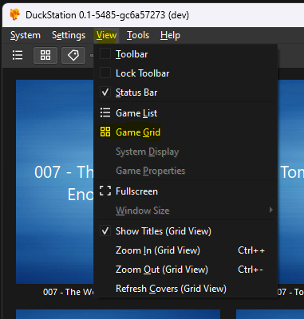
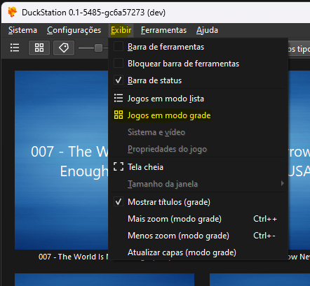
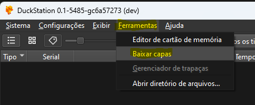
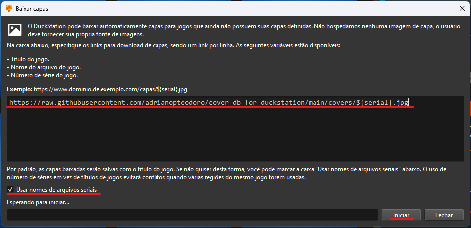
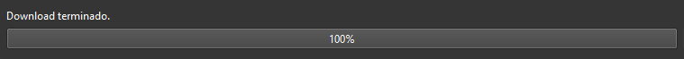

# cover-db-for-duckstation

**EN-US:** A cover database for use with Duckstation

**PT-BR:** Um banco de capas para uso no Duckstation

## EN-US

### DuckStation download

Go to [duckstation.org](https://www.duckstation.org/) or [Duckstation GitHub](https://github.com/stenzek/duckstation/releases/tag/latest) and download for your OS
> This guide will not cover emulator setup, that can be easily found over YouTube

### Setup DuckStation to update your gamelist covers

- First set to game grid view mode, go to `View > Game Grid`

  

- After that go to `Tools > Cover Downloader` to open cover downloader window
  
  

- Add the url `https://raw.githubusercontent.com/adrianopteodoro/cover-db-for-duckstation/main/covers/${serial}.jpg`, check the `Use Serial File Names` and press `Start`
  
  

- Wait its completion
  
  

## PT-BR

### DuckStation download

Vá para [duckstation.org](https://www.duckstation.org/) ou [Duckstation GitHub](https://github.com/stenzek/duckstation/releases/tag/latest) e baixe a versão para seu sistema operacional
> Este guia não cobrirá a configuração do emulador, que pode ser facilmente encontrado no YouTube

### Configurar o Duckstation para atualizar as capas da sua lista de jogos

- Primeiramente vamos mudar para o modo de visão de grades para lista de jogos, vá em `Exibir > Jogos em modo grade`

  

- Depois vá em `Ferramentas > Baixar capas` para abrir a tela de baixar as capas
  
  

- Adicione a url `https://raw.githubusercontent.com/adrianopteodoro/cover-db-for-duckstation/main/covers/${serial}.jpg`, marque a opção `Usar nomes de arquivos seriais` e pressione `Iniciar`
  
  

- Espere até o download terminar
  
  
  
## Cover sources

- [psxdatacenter.com](https://psxdatacenter.com/sitenews.html)
