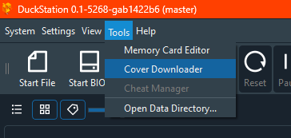
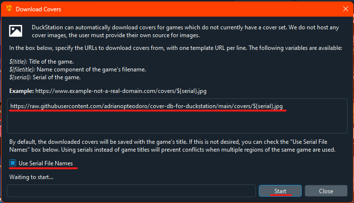
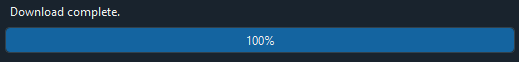

# cover-db-for-duckstation

A cover database for use with Duckstation

## Setup Duckstation to update your gamelist covers

- Make sure that you have the latest preview version of [Duckstation](https://github.com/stenzek/duckstation/releases/tag/preview)
- Go to `Tools > Cover Downloader`
  
- Add the url `https://raw.githubusercontent.com/adrianopteodoro/cover-db-for-duckstation/main/covers/${serial}.jpg`, check the `Use Serial File Names` and press `Start`
  
- Wait its completion
  

## Cover sources

- [psxdatacenter.com](https://psxdatacenter.com/sitenews.html)